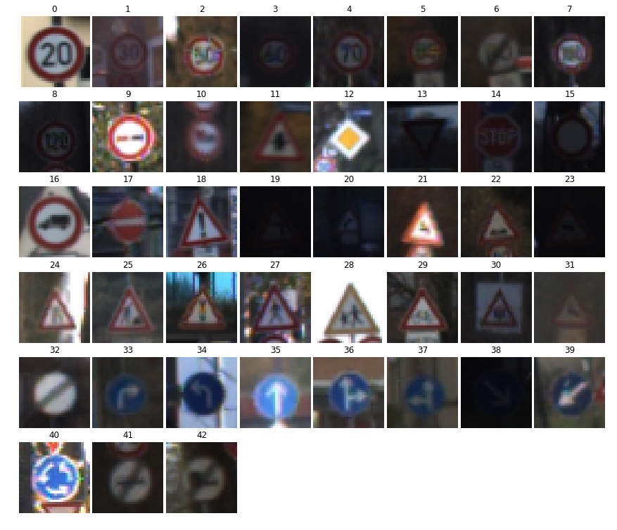

Project: Build a Traffic Sign Recognition Program
====================================================
[](http://www.udacity.com/drive)

Overview
---
In this project, I used what I've learned about deep neural networks and convolutional neural networks to classify traffic signs. I trained and validated a model so it can classify traffic sign images using the [German Traffic Sign Dataset](http://benchmark.ini.rub.de/?section=gtsrb&subsection=dataset). After the model is trained, I then tried out my model on images of German traffic signs that I find on the web.


Writeup
---
### Dataset Exploration

Using numpy and matplotlib I've gathered following statistics of the dataset as well as samples of each traffic sign class:  

Number of training examples = 34799  
Number of testing examples = 12630  
Image data shape = (32, 32, 3)  
Number of classes = 43  



### Design and Test a Model Architecture

#### Preprocessing

Before training neural network I've applied following transformations on the image datasets:  

 - **convert to grayscale**: since traffic signs have distinctive shapes and colors play secondary role in recognition I've converted all images to grayscale to simplify training process;
 - **normalization**: by normalizing images we make job easier to optimizer, which lead to faster convergence.
 
#### Model Architecture

For my neural network I've used modified LeNet architecture, which is comprised of following layers:  

 - **Input**:
    - Input = 32x32x1
 - **Layer1**:
    - Output = 28x28x6
    - Type: Convolution(kernel=5x5x1, fetures=6, stride=1, padding=VALID)
    - Activation: ReLU
 - **Layer2**:
    - Output = 14x14x6
    - Type: Pooling(kernel=1x2x2x1, stride=1x2x2x1, operation=max, padding=VALID)
 - **Layer3**:
    - Output: 10x10x16
    - Type: Convolution(kernel=5x5x6, fetures=16, stride=1, padding=VALID)
    - Activation: ReLU
 - **Layer4**:
    - Output = 5x5x16, converted to 400
    - Type: Pooling(kernel=1x2x2x1, stride=1x2x2x1, operation=max, padding=VALID)
 - **Layer5**:
    - Output = 120
    - Type: Dense
    - Activation: ReLU
    - Regularezation: dropout(p=0.5)
 - **Layer6**:
    - Output = 84
    - Type: Dense
    - Activation: ReLU
    - Regularezation: dropout(p=0.5)
 - **Layer7**:
    - Output = 43
    - Type: Dense
    - Activation: softmax
 
#### Model Training

To train the model I used AdamOptimizer to find network weights and biases. 
I chose batch size of 128 as it provided relatively fast training and fit in memory without any problems.  
And finally I ran 20 epochs of training before accuracy stopped increasing.  
Other hyperparameters that I chose inlcude: 
 - learning rate = 0.001 
 - dropout rate during training = 0.5 
 - weights initionalized from normal distribution (m=0, s=0.1)

#### Solution Approach 

After adapting LeNet to dataset I've decided to add dropout to dense layers of the network and doubles number of epochs to 20. This small modifications allowed me to achieve 96.1% accuracy on validation set. 

### Test a Model on New Images 

To test model on the samples outside of the dataset I've downloaded 5 images of German traffic signs off the internet and transformed them the same way as the dataset (resize  to 32x32, convert to grayscale, normalize). 
After running neural network on these new images I got correct prediction for all 5 images with confidence level of 99.9% on average. 


The Project
---
The goals / steps of this project are the following:
* Load the data set
* Explore, summarize and visualize the data set
* Design, train and test a model architecture
* Use the model to make predictions on new images
* Analyze the softmax probabilities of the new images
* Summarize the results with a written report

### Dependencies
This lab requires:

* [CarND Term1 Starter Kit](https://github.com/udacity/CarND-Term1-Starter-Kit)

The lab environment can be created with CarND Term1 Starter Kit. Click [here](https://github.com/udacity/CarND-Term1-Starter-Kit/blob/master/README.md) for the details.

### Dataset and Repository

1. Download the data set. The classroom has a link to the data set in the "Project Instructions" content. This is a pickled dataset in which we've already resized the images to 32x32. It contains a training, validation and test set.
2. Clone the project, which contains the Ipython notebook and the writeup template.
```sh
git clone https://github.com/udacity/CarND-Traffic-Sign-Classifier-Project
cd CarND-Traffic-Sign-Classifier-Project
jupyter notebook Traffic_Sign_Classifier.ipynb
```
